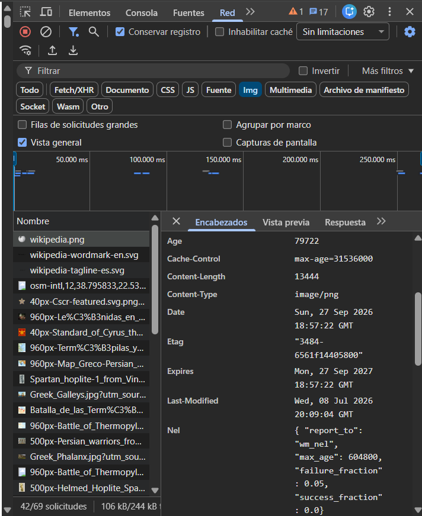
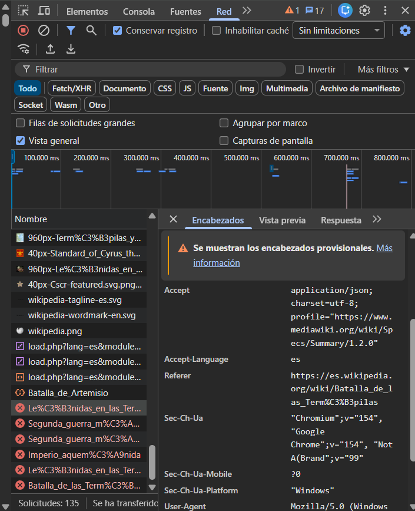

# ANÁLISIS DE WIKIPEDIA EN ESPAÑOL

### Integrantes

**Kevin Núñez Sánchez**
**Javier Becerro Batuecas**

---

## 1. Descripción del caso

En este trabajo analizamos **Wikipedia en español**, una enciclopedia en línea. Observamos cómo se carga un artículo en el navegador y cómo se comunican el navegador y los servidores de Wikipedia.

El artículo analizado es **Batalla de las Termópilas**.

**URL:** https://es.wikipedia.org/wiki/Batalla_de_las_Term%C3%B3pilas

---

## 2. Recorrido de una petición

El usuario abre el artículo en el navegador.

El navegador solicita la página y los recursos necesarios para mostrarla.

Los servidores de Wikipedia responden a esas peticiones.

El navegador procesa las respuestas y muestra el artículo.

### Esquema

**Usuario abre un artículo**
↓
**Navegador (cliente / frontend)**
↓
*Peticiones HTTP para la página y sus recursos*
↓
**Servidores de Wikipedia**
↓
*Respuestas HTTP*
↓
**Navegador procesa las respuestas y muestra el artículo**

---

## 3. Reparto entre frontend y backend

### Frontend (navegador)

* Muestra el artículo y los controles de la página.
* Solicita los recursos necesarios para mostrar el contenido.
* Procesa las respuestas recibidas y las presenta al usuario.

### Backend (servidores)

* Recibe las peticiones del navegador.
* Devuelve el contenido del artículo y los recursos solicitados.
* Envía respuestas HTTP que el navegador procesa para mostrar la página.

---

## 4. Cómo obtuvimos los datos

Abrimos el artículo elegido en Wikipedia.

Abrimos las herramientas de desarrollador con **F12** y seleccionamos **Red / Network**.

Recargamos la página.

Seleccionamos tres peticiones y anotamos el **método**, el **código de estado** y el encabezado **Content-Type**.

Guardamos una captura de DevTools donde se vean las peticiones y sus datos.

---

# 5. Análisis de las peticiones

## 5.1. Carga de estilos de Wikipedia

La URL empieza por:

`es.wikipedia.org/w/load.php`

y contiene parámetros relacionados con estilos y módulos de la página.

El navegador solicita esos recursos para que el artículo tenga el diseño y formato de Wikipedia.

![**\[Insertar aquí la Captura 192041\]**](Img/2.png)

---

## 5.2. Carga de los mosaicos del mapa

La petición va a:

`maps.wikimedia.org`

La URL incluye **osm-intl** y coordenadas.

Corresponde a una imagen o mosaico del mapa de OpenStreetMap que aparece en el artículo. El mapa completo se construye juntando varios mosaicos.

**[Insertar aquí la Captura 192046]**

---

## 5.3. Carga del artículo

**Captura 192035**

La URL apunta a:

`es.wikipedia.org/wiki/Batalla_de_las_Termópilas`

Es la petición del documento principal del artículo, que el navegador necesita para mostrar su contenido.

**[Insertar aquí la Captura 192035]**

---

# 6. Conclusión

Al cargar un artículo de Wikipedia, el navegador realiza peticiones HTTP a los servidores para obtener la página y los recursos que necesita.

Las respuestas incluyen distintos tipos de contenido, que el navegador procesa para mostrar el artículo.

Con **DevTools** podemos observar detalles de esas comunicaciones, como el **método**, el **estado HTTP** y el **tipo de contenido**.

---

# 7. Referencias

* **Wikipedia en español:** https://es.wikipedia.org/
* **Artículo: Batalla de las Termópilas:** https://es.wikipedia.org/wiki/Batalla_de_las_Term%C3%B3pilas
